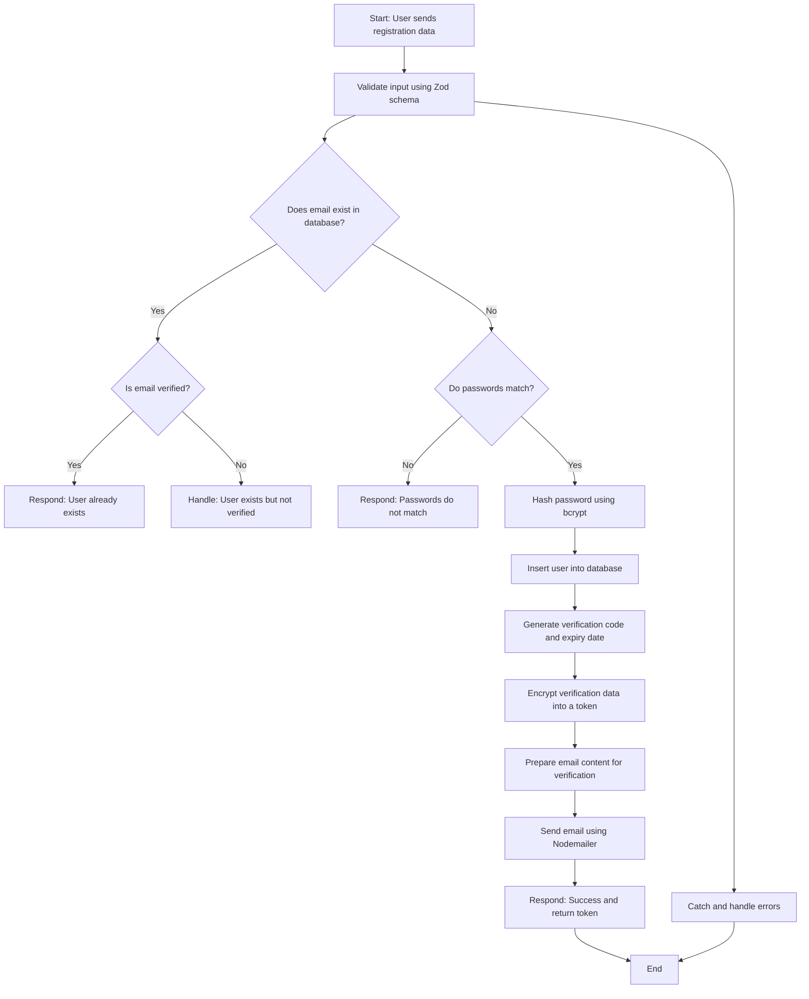

```mermaid
flowchart TD
    A[Start: User sends registration data] --> B[Validate input using Zod schema]
    B --> C{Does email exist in database?}
    C -- Yes --> D{Is email verified?}
    D -- Yes --> E[Respond: User already exists]
    D -- No --> F[Handle: User exists but not verified]
    C -- No --> G{Do passwords match?}
    G -- No --> H[Respond: Passwords do not match]
    G -- Yes --> I[Hash password using bcrypt]
    I --> J[Insert user into database]
    J --> K[Generate verification code and expiry date]
    K --> L[Encrypt verification data into a token]
    L --> M[Prepare email content for verification]
    M --> N[Send email using Nodemailer]
    N --> O[Respond: Success and return token]
    O --> P[End]
    B --> Q[Catch and handle errors]
    Q --> P
```
